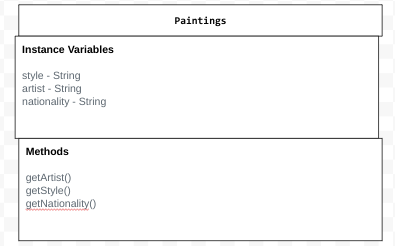

# Unit 3 - Data for Social Good Project 

## Introduction 

Software engineers develop programs to work with data and provide information to a user. Each user has different needs based on the information they are looking for from data. Your goal is to create a data analysis program for your user that stores and analyzes data to provide the information they need. 

## Requirements 

Use your knowledge of object-oriented programming, one-dimensional (1D) arrays, and algorithms to create your data analysis program: 
- **Write a class** – Write a class to represent your user or business and store and analyze their data with no-argument and parameterized constructors. 
- **Create at least two 1D arrays** – Create at least two 1D arrays to store the data that your user needs information about. 
- **Write a method** – Write a method that finds or manipulates the elements in a 1D array to provide the information your user needs. 
- **Implement a toString() method** – Write a toString() method that returns general information about the data (for example, number of values in the dataset). 
- **Document your code** – Use comments to explain the purpose of the methods and code segments and note any preconditions and postconditions. 

## User Story 

Include your User Story you analyzed for your project here. Your User Story should have the following format: 

> As an art analist,   
> I want to sort art via style and nationality,   
> so that I can analyze the percentage of certain styles and nationalities in a large pool of diverse pieces of art. 

## Dataset 

Include a hyperlink to the source of your dataset used for this project. Additionally, provide a short description of each column used from the dataset, and the data type.  

Dataset: [Famous Paintings](https://www.kaggle.com/datasets/mexwell/famous-paintings) 

- **Full Name** (String) - full name of the artists 
- **Nationality** (String) - different nationalities of the artists
- **Style** (String) - different styles of art

## UML Diagram 

 

## Description 

This project is designed to analyze a collection of artists using a data structure involving a 1D array. We utilized three text files: FullNames.txt for the names of artists, Nationality.txt for their nationalities, and Style.txt for their artistic styles. The application is part of a bigger system that helps users keep track of how many artists are from a certain country or follow a specific style. We initialized the 1D array of Artist objects with an initializer list taken from the text files. In our methods, we implement a loop control variable to iterate through the array, using increment operations to navigate each index. These methods also have preconditions, such as providing valid nationality or style inputs, and postconditions, ensuring accurate counts are returned. Furthermore, we used polymorphism through the Artist class to allow flexibility in expanding functionalities. Overall, this project helps users explore the diversity of artists while promoting an understanding of data management and programming concepts.